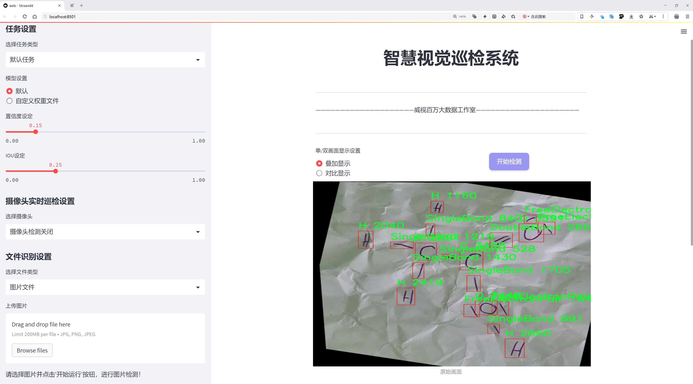
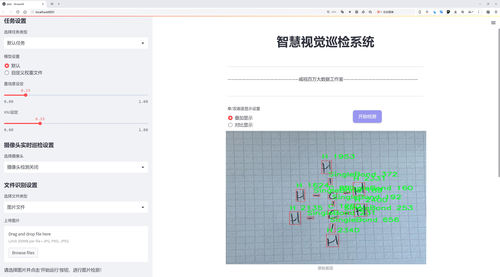
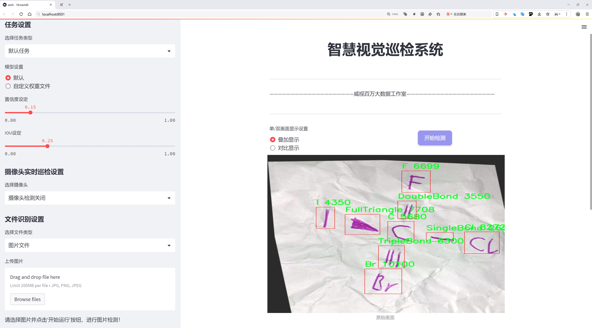
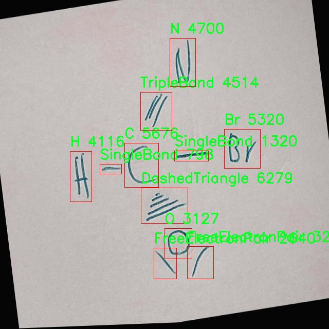
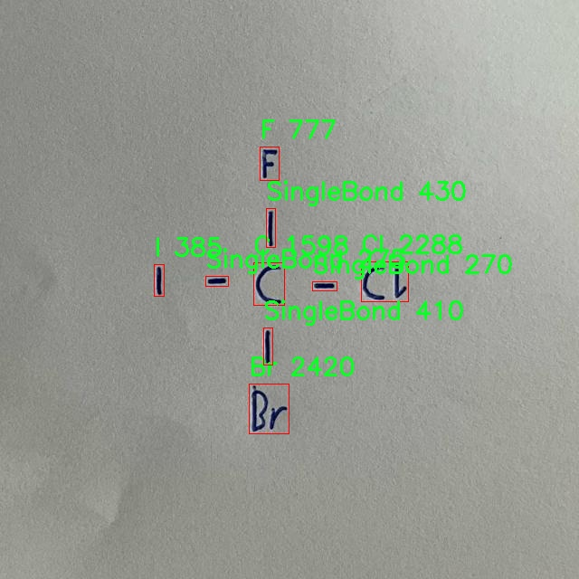
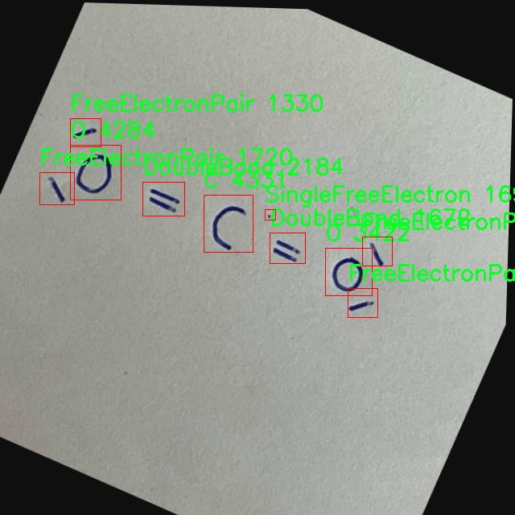
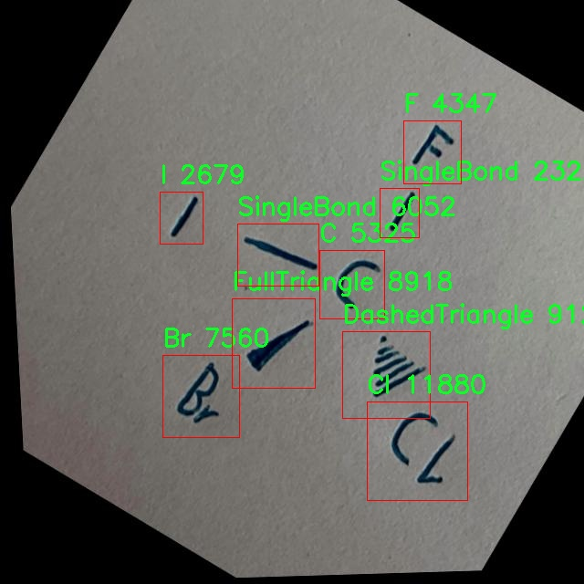
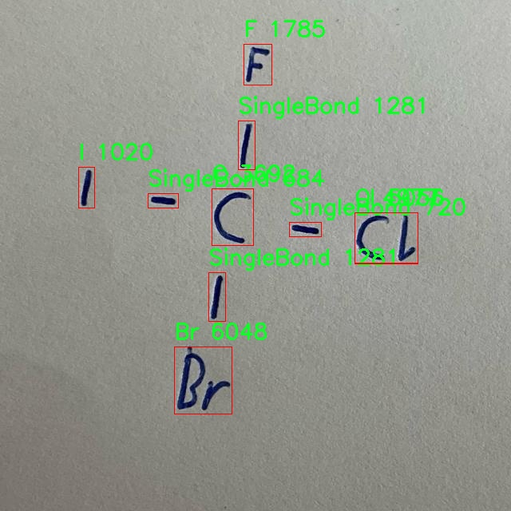

# 化学分子结构检测检测系统源码分享
 # [一条龙教学YOLOV8标注好的数据集一键训练_70+全套改进创新点发刊_Web前端展示]

### 1.研究背景与意义

项目参考[AAAI Association for the Advancement of Artificial Intelligence](https://gitee.com/qunshansj/projects)

项目来源[AACV Association for the Advancement of Computer Vision](https://gitee.com/qunmasj/projects)

研究背景与意义

随着科学技术的迅猛发展，化学分子结构的自动检测与分析在化学研究、药物开发以及材料科学等领域中变得愈发重要。传统的化学分子结构分析方法往往依赖于人工识别和经验判断，这不仅耗时耗力，而且容易受到人为因素的影响，导致结果的不一致性和不准确性。因此，开发一种高效、准确的化学分子结构检测系统显得尤为必要。近年来，深度学习技术的快速发展为图像识别和目标检测提供了新的解决方案，尤其是YOLO（You Only Look Once）系列模型在实时目标检测方面展现出了优异的性能。

本研究旨在基于改进的YOLOv8模型，构建一个高效的化学分子结构检测系统。YOLOv8作为YOLO系列的最新版本，结合了更深层次的网络结构和更高效的特征提取机制，能够在保证检测精度的同时显著提高检测速度。通过对YOLOv8模型的改进，特别是在处理化学分子特征方面的优化，可以更好地适应化学分子结构的复杂性和多样性。

在本研究中，我们使用了MoleculeParts数据集，该数据集包含1800幅图像，涵盖18个类别的化学分子结构元素，包括原子（如Br、C、Cl、F、H、I、N、O、S）、化学键（如SingleBond、DoubleBond、TripleBond）以及其他结构特征（如DashedTriangle、FullTriangle、FreeElectronPair、SingleFreeElectron、Negative、Positive）。这些类别的多样性为模型的训练提供了丰富的样本，有助于提高模型对不同化学结构的识别能力。

本研究的意义不仅在于提升化学分子结构检测的效率和准确性，更在于推动化学信息学的发展。通过自动化的检测系统，研究人员可以更快速地分析化学分子，进而加速新药的研发和材料的设计。此外，改进的YOLOv8模型也可以为其他领域的目标检测提供借鉴，推动计算机视觉技术在科学研究中的应用。

在未来的研究中，我们计划进一步扩展数据集的规模，增加更多复杂的化学分子结构，以提升模型的泛化能力。同时，结合迁移学习和集成学习等先进技术，进一步优化模型的性能。通过这些努力，我们希望能够建立一个具有广泛应用前景的化学分子结构检测系统，为化学研究提供强有力的技术支持，助力科学探索的深入发展。

### 2.图片演示







##### 注意：由于此博客编辑较早，上面“2.图片演示”和“3.视频演示”展示的系统图片或者视频可能为老版本，新版本在老版本的基础上升级如下：（实际效果以升级的新版本为准）

  （1）适配了YOLOV8的“目标检测”模型和“实例分割”模型，通过加载相应的权重（.pt）文件即可自适应加载模型。

  （2）支持“图片识别”、“视频识别”、“摄像头实时识别”三种识别模式。

  （3）支持“图片识别”、“视频识别”、“摄像头实时识别”三种识别结果保存导出，解决手动导出（容易卡顿出现爆内存）存在的问题，识别完自动保存结果并导出到tempDir中。

  （4）支持Web前端系统中的标题、背景图等自定义修改，后面提供修改教程。

  另外本项目提供训练的数据集和训练教程,暂不提供权重文件（best.pt）,需要您按照教程进行训练后实现图片演示和Web前端界面演示的效果。

### 3.视频演示

[3.1 视频演示](https://www.bilibili.com/video/BV17ztoeDEVM/)

### 4.数据集信息展示

##### 4.1 本项目数据集详细数据（类别数＆类别名）

nc: 18
names: ['Br', 'C', 'Cl', 'DashedTriangle', 'DoubleBond', 'F', 'FreeElectronPair', 'FullTriangle', 'H', 'I', 'N', 'Negative', 'O', 'Positive', 'S', 'SingleBond', 'SingleFreeElectron', 'TripleBond']


##### 4.2 本项目数据集信息介绍

数据集信息展示

在化学分子结构检测领域，数据集的构建和选择至关重要。为改进YOLOv8的化学分子结构检测系统，我们选用了名为“MoleculeParts”的数据集。该数据集专注于化学分子的不同组成部分，旨在为深度学习模型提供丰富的训练样本，以提高其在分子结构识别中的准确性和鲁棒性。MoleculeParts数据集包含18个类别，涵盖了化学分子中常见的元素和结构特征，具体类别包括：溴（Br）、碳（C）、氯（Cl）、虚线三角形（DashedTriangle）、双键（DoubleBond）、氟（F）、自由电子对（FreeElectronPair）、实心三角形（FullTriangle）、氢（H）、碘（I）、氮（N）、负电荷（Negative）、氧（O）、正电荷（Positive）、硫（S）、单键（SingleBond）、单自由电子（SingleFreeElectron）以及三键（TripleBond）。

每个类别在数据集中都有相应的标注，确保模型在训练过程中能够学习到每种化学成分的特征和结构。这些类别不仅涵盖了常见的元素符号，还包括了化学键的不同表示方式，如单键、双键和三键等。这种多样性使得MoleculeParts数据集能够为YOLOv8模型提供全面的学习材料，从而增强其在复杂分子结构中的检测能力。

MoleculeParts数据集的设计考虑到了化学分子结构的多样性和复杂性。每个类别的样本都经过精心挑选，确保在不同的分子环境中都能得到有效的识别。比如，碳（C）和氢（H）作为有机化合物的基本组成部分，其在数据集中占据了重要位置；而像负电荷（Negative）和正电荷（Positive）这样的类别则帮助模型理解分子中电荷的分布及其对分子行为的影响。此外，虚线三角形和实心三角形的引入，旨在帮助模型识别分子中的立体结构特征，这对于理解分子的空间构型至关重要。

在数据集的构建过程中，图像的质量和标注的准确性是重中之重。每个样本图像都经过高分辨率拍摄，并且在标注时遵循严格的标准，以确保每个分子部分都能被清晰地识别和分类。这种高质量的标注不仅提高了模型的训练效率，也为后续的测试和验证提供了可靠的基础。

为了确保模型的泛化能力，MoleculeParts数据集还考虑了样本的多样性，包括不同的分子结构、不同的化学环境以及不同的光照条件等。这种多样性使得模型在面对未知的分子结构时，依然能够保持较高的识别准确率。

总之，MoleculeParts数据集为改进YOLOv8的化学分子结构检测系统提供了坚实的基础。通过对18个类别的全面覆盖，数据集不仅为模型的训练提供了丰富的样本，还为化学分子结构的深入研究奠定了基础。随着该数据集的应用，期待在化学分子识别领域取得更为显著的进展。











### 5.全套项目环境部署视频教程（零基础手把手教学）

[5.1 环境部署教程链接（零基础手把手教学）](https://www.ixigua.com/7404473917358506534?logTag=c807d0cbc21c0ef59de5)


[5.2 安装Python虚拟环境创建和依赖库安装视频教程链接（零基础手把手教学）](https://www.ixigua.com/7404474678003106304?logTag=1f1041108cd1f708b01a)

### 6.手把手YOLOV8训练视频教程（零基础小白有手就能学会）

[6.1 手把手YOLOV8训练视频教程（零基础小白有手就能学会）](https://www.ixigua.com/7404477157818401292?logTag=d31a2dfd1983c9668658)

### 7.70+种全套YOLOV8创新点代码加载调参视频教程（一键加载写好的改进模型的配置文件）

[7.1 70+种全套YOLOV8创新点代码加载调参视频教程（一键加载写好的改进模型的配置文件）](https://www.ixigua.com/7404478314661806627?logTag=29066f8288e3f4eea3a4)

### 8.70+种全套YOLOV8创新点原理讲解（非科班也可以轻松写刊发刊，V10版本正在科研待更新）

由于篇幅限制，每个创新点的具体原理讲解就不一一展开，具体见下列网址中的创新点对应子项目的技术原理博客网址【Blog】：


[8.1 70+种全套YOLOV8创新点原理讲解链接](https://gitee.com/qunmasj/good)

### 9.系统功能展示（检测对象为举例，实际内容以本项目数据集为准）

图9.1.系统支持检测结果表格显示

  图9.2.系统支持置信度和IOU阈值手动调节

  图9.3.系统支持自定义加载权重文件best.pt(需要你通过步骤5中训练获得)

  图9.4.系统支持摄像头实时识别

  图9.5.系统支持图片识别

  图9.6.系统支持视频识别

  图9.7.系统支持识别结果文件自动保存

  图9.8.系统支持Excel导出检测结果数据


### 10.原始YOLOV8算法原理

原始YOLOv8算法原理

YOLOv8算法是目标检测领域的一项重要进展，它在YOLOv5的基础上进行了多方面的优化和改进，旨在提高检测精度和速度。YOLOv8的核心理念是通过将整个图像作为输入，直接在图像上进行目标检测和定位，从而避免了传统方法中滑动窗口或区域提议的复杂性。这种方法不仅提升了检测的效率，还显著提高了模型的实时性，适用于智能监控、自动驾驶和人脸识别等多种应用场景。

YOLOv8的网络结构主要由三个部分组成：骨干特征提取网络层、特征融合层和检测头层。骨干网络的设计是YOLOv8的关键，它采用了轻量化的C2F模块替代了原有的C3模块。C2F模块通过引入更多的跳层连接，增强了梯度流的传递，进而提高了特征提取的能力。同时，YOLOv8在卷积操作中使用了3×3的卷积核，并将深度调整为3、6、6、3，以实现更高效的特征提取。

在特征融合层，YOLOv8采用了特征金字塔网络（FPN）和路径聚合网络（PAN）的结合，以更好地处理不同尺度的特征信息。特征金字塔网络通过构建多层次的特征图，使得模型能够有效地捕捉到不同尺度的目标，而路径聚合网络则通过优化特征的传递路径，增强了信息的融合效果。此外，YOLOv8还引入了BiFPN网络，以实现高效的双向跨尺度连接和加权特征融合，从而进一步提升了模型对多尺度特征的提取速度。

在检测头层，YOLOv8采用了轻量化的解耦头结构，替代了传统的耦合头。这种解耦头的设计使得模型能够分别提取类别和位置特征，针对分类和定位任务的不同需求进行优化。具体而言，分类任务更关注特征图中与已知类别的相似性，而定位任务则强调边界框与真实框之间的关系。通过这种方式，YOLOv8在收敛速度和预测精度上都有了显著提升。

值得注意的是，YOLOv8在训练过程中对数据增强策略进行了优化。虽然Mosaic数据增强可以提升模型的鲁棒性和泛化能力，但在某些情况下，它可能会破坏数据的真实分布。为此，YOLOv8在训练的最后10个epoch中停止使用Mosaic数据增强，以确保模型能够更好地学习到真实的特征分布。

YOLOv8还引入了无锚框结构，直接预测目标的中心，并通过任务对齐学习（TAL）来区分正负样本。这一创新的设计使得模型在定位和分类任务中能够更好地平衡两者的性能。具体而言，YOLOv8在损失函数中引入了分类分数和IOU的高次幂乘积，作为衡量任务对齐程度的指标，从而进一步提升了模型的检测效果。

在实际应用中，YOLOv8展现出了卓越的性能。通过与其他目标检测算法的比较，YOLOv8在精度和帧率上均表现出色。例如，与SSD算法相比，YOLOv8的精度提高了43.23%，帧率提升了10.28倍。这一系列的改进使得YOLOv8成为目标检测领域中一款极具竞争力的模型，能够满足实时性和准确性的双重需求。

综上所述，YOLOv8算法通过一系列的结构优化和创新设计，在目标检测任务中实现了显著的性能提升。其轻量化的网络结构、高效的特征提取和融合策略，以及针对性强的检测头设计，使得YOLOv8在多种应用场景中都具备了良好的适应性和实用性。随着YOLOv8的不断发展和应用，未来在目标检测领域的研究和实践中，它无疑将发挥更为重要的作用。


### 11.项目核心源码讲解（再也不用担心看不懂代码逻辑）

#### 11.1 code\ultralytics\nn\autobackend.py

以下是经过精简和注释的核心代码部分，主要集中在模型的加载和推理部分。注释将帮助理解每个部分的功能和目的。

```python
import torch
import torch.nn as nn
from ultralytics.utils import LOGGER, yaml_load, check_requirements

class AutoBackend(nn.Module):
    """
    处理Ultralytics YOLO模型的动态后端选择，用于推理。
    """

    @torch.no_grad()
    def __init__(self, weights="yolov8n.pt", device=torch.device("cpu"), fp16=False, fuse=True):
        """
        初始化AutoBackend进行推理。

        参数:
            weights (str): 模型权重文件的路径，默认为'yolov8n.pt'。
            device (torch.device): 运行模型的设备，默认为CPU。
            fp16 (bool): 启用半精度推理，默认为False。
            fuse (bool): 融合Conv2D和BatchNorm层以优化，默认为True。
        """
        super().__init__()
        self.device = device
        self.fp16 = fp16

        # 加载模型
        model_type = self._model_type(weights)
        if model_type[0]:  # 如果是PyTorch模型
            self.model = torch.load(weights, map_location=device)
            if fuse:
                self.model = self.model.fuse()  # 融合层
            self.model.to(device)
            self.model.half() if fp16 else self.model.float()  # 设置为半精度或全精度
        else:
            raise TypeError(f"不支持的模型格式: {weights}")

    def forward(self, im):
        """
        在YOLOv8 MultiBackend模型上运行推理。

        参数:
            im (torch.Tensor): 要进行推理的图像张量。

        返回:
            (torch.Tensor): 推理的输出张量。
        """
        if self.fp16 and im.dtype != torch.float16:
            im = im.half()  # 转换为FP16
        y = self.model(im)  # 执行推理
        return y

    @staticmethod
    def _model_type(p):
        """
        根据模型文件路径返回模型类型。

        参数:
            p: 模型文件的路径。
        返回:
            list: 模型类型的布尔值列表。
        """
        types = [p.endswith('.pt')]  # 检查是否为PyTorch模型
        return types
```

### 代码分析

1. **类定义**:
   - `AutoBackend`类用于处理不同后端的模型推理。它继承自`nn.Module`，因此可以利用PyTorch的模块化特性。

2. **初始化方法**:
   - `__init__`方法负责初始化模型，加载权重，并根据需要进行层融合和精度设置。

3. **前向推理方法**:
   - `forward`方法接受输入图像张量，执行推理并返回输出。根据设置的精度，可能会将输入转换为半精度。

4. **模型类型检查**:
   - `_model_type`静态方法用于确定模型文件的类型，以便正确加载。

### 重要概念
- **动态后端选择**: 该类支持根据输入模型格式动态选择推理后端，使得模型可以在不同的环境中运行。
- **半精度推理**: 通过使用半精度浮点数，可以提高推理速度并减少内存使用，适用于支持FP16的硬件。
- **层融合**: 融合操作可以减少模型的计算量，提高推理效率。

以上是代码的核心部分及其详细注释，旨在帮助理解YOLO模型的加载和推理过程。

这个文件是Ultralytics YOLO（You Only Look Once）模型的一个重要组成部分，主要负责动态选择后端以进行推理。文件中定义了一个名为`AutoBackend`的类，该类能够处理多种模型格式，支持在不同平台上部署模型。以下是对文件内容的详细分析。

首先，文件导入了一些必要的库，包括`torch`、`cv2`、`numpy`等，这些库为模型的加载和推理提供了支持。接着，定义了一些辅助函数，比如`check_class_names`和`default_class_names`，它们用于检查和处理类名，以确保模型的输出与输入数据集的类名一致。

`AutoBackend`类的构造函数`__init__`接收多个参数，包括模型权重文件的路径、设备类型（CPU或GPU）、是否使用DNN模块进行ONNX推理、数据文件路径、是否启用半精度推理等。构造函数中，首先会根据权重文件的后缀判断模型的类型，然后根据模型类型加载相应的模型。支持的模型格式包括PyTorch、TorchScript、ONNX、OpenVINO、TensorRT、CoreML、TensorFlow等。

在加载模型时，构造函数会进行一系列的检查和设置，比如确定是否使用CUDA、是否需要下载模型文件等。加载完成后，模型的元数据（如类名、输入尺寸等）也会被提取和存储。

`forward`方法是`AutoBackend`类的核心，用于执行推理。它接收一个图像张量，并根据模型类型调用相应的推理方法。支持的推理方式包括直接使用PyTorch模型、TorchScript、ONNX Runtime、OpenVINO、TensorRT等。根据输入的图像张量，`forward`方法会进行必要的格式转换，并返回推理结果。

此外，`from_numpy`方法用于将NumPy数组转换为PyTorch张量，而`warmup`方法则用于通过运行一次前向传递来预热模型，以提高后续推理的速度。

最后，`_model_type`静态方法用于根据模型文件的路径返回模型的类型。这一方法会检查文件后缀，并根据后缀确定模型的格式。

总体来说，这个文件为YOLO模型的推理提供了灵活的后端支持，使得用户可以方便地在不同的环境中使用模型进行推理。通过对不同模型格式的支持，`AutoBackend`类极大地提高了模型的可用性和灵活性。

#### 11.2 ui.py

```python
import sys
import subprocess

def run_script(script_path):
    """
    使用当前 Python 环境运行指定的脚本。

    Args:
        script_path (str): 要运行的脚本路径

    Returns:
        None
    """
    # 获取当前 Python 解释器的路径
    python_path = sys.executable

    # 构建运行命令，使用 streamlit 运行指定的脚本
    command = f'"{python_path}" -m streamlit run "{script_path}"'

    # 执行命令
    result = subprocess.run(command, shell=True)
    # 检查命令执行的返回码，若不为0则表示出错
    if result.returncode != 0:
        print("脚本运行出错。")


# 实例化并运行应用
if __name__ == "__main__":
    # 指定要运行的脚本路径
    script_path = "web.py"  # 这里可以直接指定脚本名，假设在当前目录下

    # 运行脚本
    run_script(script_path)
```

### 代码核心部分及注释说明：

1. **导入模块**：
   - `import sys`: 导入系统相关的模块，用于获取当前 Python 解释器的路径。
   - `import subprocess`: 导入子进程模块，用于执行外部命令。

2. **定义 `run_script` 函数**：
   - 该函数接收一个参数 `script_path`，表示要运行的 Python 脚本的路径。
   - 使用 `sys.executable` 获取当前 Python 解释器的路径，以确保在当前环境中运行脚本。
   - 构建命令字符串，使用 `streamlit` 运行指定的脚本。
   - 使用 `subprocess.run` 执行构建的命令，并检查返回码以判断脚本是否成功运行。

3. **主程序入口**：
   - 使用 `if __name__ == "__main__":` 确保只有在直接运行该脚本时才会执行以下代码。
   - 指定要运行的脚本路径 `script_path`，这里假设脚本 `web.py` 在当前目录下。
   - 调用 `run_script` 函数来执行指定的脚本。

这个程序文件的主要功能是通过当前的 Python 环境来运行一个指定的脚本，具体来说是一个名为 `web.py` 的脚本。首先，程序导入了必要的模块，包括 `sys`、`os` 和 `subprocess`，这些模块提供了与系统交互的功能。

在 `run_script` 函数中，首先获取当前 Python 解释器的路径，这样可以确保使用正确的 Python 环境来执行脚本。接着，构建一个命令字符串，该命令使用 `streamlit` 模块来运行指定的脚本。`streamlit` 是一个用于构建数据应用的库，这里通过 `-m` 参数来指定模块运行。

然后，使用 `subprocess.run` 方法来执行构建好的命令。这个方法会在一个新的 shell 中运行命令，并等待其完成。如果脚本运行过程中出现错误，返回的状态码将不为零，程序会打印出“脚本运行出错”的提示信息。

在文件的最后部分，使用 `if __name__ == "__main__":` 语句来确保只有在直接运行该文件时才会执行下面的代码。这里指定了要运行的脚本路径，即 `web.py`，并调用 `run_script` 函数来执行这个脚本。

整体来看，这个程序提供了一种简便的方式来运行一个特定的 Python 脚本，特别是用于启动基于 `streamlit` 的 web 应用。

#### 11.3 70+种YOLOv8算法改进源码大全和调试加载训练教程（非必要）\ultralytics\trackers\track.py

以下是代码中最核心的部分，并附上详细的中文注释：

```python
# 导入必要的库和模块
from functools import partial
import torch
from ultralytics.utils import IterableSimpleNamespace, yaml_load
from ultralytics.utils.checks import check_yaml
from .bot_sort import BOTSORT
from .byte_tracker import BYTETracker

# 定义跟踪器映射，便于根据名称获取对应的跟踪器类
TRACKER_MAP = {'bytetrack': BYTETracker, 'botsort': BOTSORT}

def on_predict_start(predictor, persist=False):
    """
    在预测开始时初始化对象跟踪器。

    参数:
        predictor (object): 用于初始化跟踪器的预测器对象。
        persist (bool, optional): 如果跟踪器已存在，是否保持它们。默认为 False。

    异常:
        AssertionError: 如果 tracker_type 不是 'bytetrack' 或 'botsort'。
    """
    # 如果预测器已经有跟踪器并且需要保持，则直接返回
    if hasattr(predictor, 'trackers') and persist:
        return
    
    # 检查并加载跟踪器的配置文件
    tracker = check_yaml(predictor.args.tracker)
    cfg = IterableSimpleNamespace(**yaml_load(tracker))
    
    # 确保跟踪器类型是支持的类型
    assert cfg.tracker_type in ['bytetrack', 'botsort'], \
        f"只支持 'bytetrack' 和 'botsort'，但得到的是 '{cfg.tracker_type}'"
    
    # 初始化跟踪器列表
    trackers = []
    for _ in range(predictor.dataset.bs):  # 遍历批次大小
        # 根据配置创建对应的跟踪器实例
        tracker = TRACKER_MAP[cfg.tracker_type](args=cfg, frame_rate=30)
        trackers.append(tracker)  # 将跟踪器添加到列表中
    
    # 将创建的跟踪器列表赋值给预测器
    predictor.trackers = trackers

def on_predict_postprocess_end(predictor):
    """后处理检测到的框并更新对象跟踪。"""
    bs = predictor.dataset.bs  # 获取批次大小
    im0s = predictor.batch[1]  # 获取输入图像
    for i in range(bs):
        det = predictor.results[i].boxes.cpu().numpy()  # 获取检测结果
        if len(det) == 0:  # 如果没有检测到目标，跳过
            continue
        
        # 更新跟踪器并获取跟踪结果
        tracks = predictor.trackers[i].update(det, im0s[i])
        if len(tracks) == 0:  # 如果没有跟踪到目标，跳过
            continue
        
        idx = tracks[:, -1].astype(int)  # 获取跟踪的索引
        predictor.results[i] = predictor.results[i][idx]  # 更新检测结果
        predictor.results[i].update(boxes=torch.as_tensor(tracks[:, :-1]))  # 更新框信息

def register_tracker(model, persist):
    """
    为模型注册跟踪回调，以便在预测期间进行对象跟踪。

    参数:
        model (object): 要注册跟踪回调的模型对象。
        persist (bool): 如果跟踪器已存在，是否保持它们。
    """
    # 添加预测开始时的回调
    model.add_callback('on_predict_start', partial(on_predict_start, persist=persist))
    # 添加后处理结束时的回调
    model.add_callback('on_predict_postprocess_end', on_predict_postprocess_end)
```

### 代码核心部分说明：
1. **导入模块**：导入了必要的库和模块，包括跟踪器的实现。
2. **跟踪器映射**：使用字典将跟踪器名称映射到对应的类，方便后续根据配置动态创建实例。
3. **`on_predict_start` 函数**：在预测开始时初始化跟踪器，检查配置文件并创建相应的跟踪器实例。
4. **`on_predict_postprocess_end` 函数**：在预测后处理阶段更新检测结果，结合跟踪器的输出更新检测框。
5. **`register_tracker` 函数**：为模型注册回调函数，以便在预测过程中执行跟踪操作。

这个程序文件主要是实现了YOLOv8模型在进行目标检测时的跟踪功能。代码中使用了两个跟踪器：BYTETracker和BOTSORT，这两种跟踪器分别在TRACKER_MAP字典中进行了映射。文件的主要功能是初始化跟踪器、处理预测结果以及注册跟踪回调。

在`on_predict_start`函数中，首先检查预测器对象是否已经有跟踪器，如果有且`persist`参数为真，则直接返回。接着，函数会从预测器的参数中加载跟踪器的配置，并确保所使用的跟踪器类型是支持的（即'bytetrack'或'botsort'）。如果配置有效，则为每个批次创建一个跟踪器实例，并将其存储在预测器的`trackers`属性中。

`on_predict_postprocess_end`函数则是在检测到目标后进行后处理。它从预测器中获取当前批次的检测结果，并对每个检测结果进行跟踪更新。如果检测结果为空，则跳过该批次。对于每个有效的检测结果，调用相应的跟踪器进行更新，并根据跟踪结果更新预测器的结果。

最后，`register_tracker`函数用于将跟踪回调注册到模型中。它使用`add_callback`方法将`on_predict_start`和`on_predict_postprocess_end`函数与模型的预测过程关联起来，以便在预测开始和结束时执行相应的跟踪操作。

总体而言，这段代码为YOLOv8模型提供了一个灵活的框架，使其能够在目标检测的基础上实现更复杂的目标跟踪功能。通过选择不同的跟踪器，用户可以根据具体需求进行调整和优化。

#### 11.4 train.py

以下是经过简化和注释的核心代码部分：

```python
import random
import numpy as np
import torch.nn as nn
from ultralytics.data import build_dataloader, build_yolo_dataset
from ultralytics.engine.trainer import BaseTrainer
from ultralytics.models import yolo
from ultralytics.nn.tasks import DetectionModel
from ultralytics.utils import LOGGER, RANK
from ultralytics.utils.torch_utils import de_parallel, torch_distributed_zero_first

class DetectionTrainer(BaseTrainer):
    """
    基于检测模型的训练类，继承自BaseTrainer类。
    """

    def build_dataset(self, img_path, mode="train", batch=None):
        """
        构建YOLO数据集。

        参数:
            img_path (str): 包含图像的文件夹路径。
            mode (str): 模式，'train'或'val'，用户可以为每种模式自定义不同的增强。
            batch (int, optional): 批量大小，仅用于'rect'模式。默认为None。
        """
        gs = max(int(de_parallel(self.model).stride.max() if self.model else 0), 32)
        return build_yolo_dataset(self.args, img_path, batch, self.data, mode=mode, rect=mode == "val", stride=gs)

    def get_dataloader(self, dataset_path, batch_size=16, rank=0, mode="train"):
        """构造并返回数据加载器。"""
        assert mode in ["train", "val"]
        with torch_distributed_zero_first(rank):  # 仅在DDP中初始化数据集*.cache一次
            dataset = self.build_dataset(dataset_path, mode, batch_size)
        shuffle = mode == "train"  # 训练模式下打乱数据
        workers = self.args.workers if mode == "train" else self.args.workers * 2
        return build_dataloader(dataset, batch_size, workers, shuffle, rank)  # 返回数据加载器

    def preprocess_batch(self, batch):
        """对图像批次进行预处理，包括缩放和转换为浮点数。"""
        batch["img"] = batch["img"].to(self.device, non_blocking=True).float() / 255  # 归一化图像
        if self.args.multi_scale:  # 如果启用多尺度
            imgs = batch["img"]
            sz = (
                random.randrange(self.args.imgsz * 0.5, self.args.imgsz * 1.5 + self.stride)
                // self.stride
                * self.stride
            )  # 随机选择新的尺寸
            sf = sz / max(imgs.shape[2:])  # 计算缩放因子
            if sf != 1:
                ns = [
                    math.ceil(x * sf / self.stride) * self.stride for x in imgs.shape[2:]
                ]  # 计算新的形状
                imgs = nn.functional.interpolate(imgs, size=ns, mode="bilinear", align_corners=False)  # 进行插值
            batch["img"] = imgs
        return batch

    def get_model(self, cfg=None, weights=None, verbose=True):
        """返回YOLO检测模型。"""
        model = DetectionModel(cfg, nc=self.data["nc"], verbose=verbose and RANK == -1)
        if weights:
            model.load(weights)  # 加载权重
        return model

    def plot_training_samples(self, batch, ni):
        """绘制带有注释的训练样本。"""
        plot_images(
            images=batch["img"],
            batch_idx=batch["batch_idx"],
            cls=batch["cls"].squeeze(-1),
            bboxes=batch["bboxes"],
            paths=batch["im_file"],
            fname=self.save_dir / f"train_batch{ni}.jpg",
            on_plot=self.on_plot,
        )

    def plot_metrics(self):
        """从CSV文件中绘制指标。"""
        plot_results(file=self.csv, on_plot=self.on_plot)  # 保存结果图
```

### 代码说明：
1. **导入模块**：导入必要的库和模块，包括数据处理、模型构建和工具函数。
2. **DetectionTrainer类**：这是一个用于训练YOLO检测模型的类，继承自`BaseTrainer`。
3. **build_dataset方法**：根据给定的图像路径和模式构建YOLO数据集。
4. **get_dataloader方法**：构造数据加载器，支持训练和验证模式。
5. **preprocess_batch方法**：对输入的图像批次进行预处理，包括归一化和多尺度调整。
6. **get_model方法**：返回一个YOLO检测模型，可以选择加载预训练权重。
7. **plot_training_samples方法**：绘制训练样本及其注释，用于可视化训练过程。
8. **plot_metrics方法**：从CSV文件中绘制训练指标，便于分析模型性能。

这个程序文件 `train.py` 是一个用于训练目标检测模型的脚本，主要基于 YOLO（You Only Look Once）架构。文件中定义了一个名为 `DetectionTrainer` 的类，它继承自 `BaseTrainer` 类，专门用于处理目标检测任务。

在这个类中，首先通过 `build_dataset` 方法构建 YOLO 数据集，接受图像路径、模式（训练或验证）和批量大小作为参数。该方法会根据模型的步幅（stride）来确定图像的缩放比例，并调用 `build_yolo_dataset` 函数来创建数据集。

接下来，`get_dataloader` 方法用于构建数据加载器，确保在分布式训练中只初始化一次数据集。它根据模式（训练或验证）设置是否打乱数据，并根据需要调整工作线程的数量。

`preprocess_batch` 方法负责对图像批次进行预处理，包括将图像缩放到适当的大小并转换为浮点数。该方法还支持多尺度训练，通过随机选择图像大小来增强模型的鲁棒性。

`set_model_attributes` 方法用于设置模型的属性，包括类别数量和类别名称。这些信息是从数据集中提取的，并附加到模型上。

`get_model` 方法返回一个 YOLO 检测模型，支持加载预训练权重。`get_validator` 方法则返回一个用于模型验证的 `DetectionValidator` 实例，负责计算损失并评估模型性能。

`label_loss_items` 方法生成一个包含训练损失项的字典，便于监控训练过程中的损失变化。`progress_string` 方法返回一个格式化的字符串，显示训练进度，包括当前的 epoch、GPU 内存使用情况、损失值、实例数量和图像大小。

`plot_training_samples` 方法用于绘制训练样本及其标注，便于可视化训练数据的质量。最后，`plot_metrics` 和 `plot_training_labels` 方法分别用于绘制训练过程中的指标和标签，帮助用户分析模型的训练效果。

整体来看，这个文件提供了一个完整的训练框架，涵盖了数据集构建、数据加载、模型设置、训练过程监控和结果可视化等多个方面，为用户提供了一个高效的目标检测模型训练工具。

#### 11.5 code\ultralytics\models\yolo\obb\train.py

以下是代码中最核心的部分，并附上详细的中文注释：

```python
# 导入必要的模块
from ultralytics.models import yolo
from ultralytics.nn.tasks import OBBModel
from ultralytics.utils import DEFAULT_CFG, RANK

class OBBTrainer(yolo.detect.DetectionTrainer):
    """
    OBBTrainer类，扩展了DetectionTrainer类，用于基于定向边界框（OBB）模型的训练。
    """

    def __init__(self, cfg=DEFAULT_CFG, overrides=None, _callbacks=None):
        """初始化OBBTrainer对象，接受配置和重写参数。"""
        if overrides is None:
            overrides = {}
        # 设置任务类型为'obb'
        overrides["task"] = "obb"
        # 调用父类的初始化方法
        super().__init__(cfg, overrides, _callbacks)

    def get_model(self, cfg=None, weights=None, verbose=True):
        """返回使用指定配置和权重初始化的OBBModel模型。"""
        # 创建OBBModel实例，ch为输入通道数，nc为类别数
        model = OBBModel(cfg, ch=3, nc=self.data["nc"], verbose=verbose and RANK == -1)
        # 如果提供了权重，则加载权重
        if weights:
            model.load(weights)

        return model

    def get_validator(self):
        """返回OBBValidator实例，用于YOLO模型的验证。"""
        # 定义损失名称
        self.loss_names = "box_loss", "cls_loss", "dfl_loss"
        # 返回OBBValidator实例
        return yolo.obb.OBBValidator(self.test_loader, save_dir=self.save_dir, args=copy(self.args))
```

### 代码注释说明：
1. **导入模块**：导入YOLO模型相关的模块和工具，主要用于模型的构建和训练。
2. **OBBTrainer类**：这是一个继承自`DetectionTrainer`的类，专门用于处理定向边界框（OBB）模型的训练。
3. **初始化方法**：在初始化时，设置任务类型为'obb'，并调用父类的初始化方法以确保正确设置。
4. **获取模型方法**：`get_model`方法用于创建和返回一个OBB模型实例，可以选择性地加载预训练权重。
5. **获取验证器方法**：`get_validator`方法返回一个OBBValidator实例，用于模型训练后的验证，同时定义了损失名称以便于后续的损失计算和监控。

这个程序文件定义了一个名为 `OBBTrainer` 的类，该类用于基于定向边界框（Oriented Bounding Box, OBB）模型的训练。`OBBTrainer` 类继承自 `yolo.detect.DetectionTrainer`，这是一个用于目标检测的训练器类。

在类的文档字符串中，提供了一个使用示例，展示了如何实例化 `OBBTrainer` 并调用其 `train` 方法进行训练。示例中，用户需要提供模型文件、数据集配置文件和训练的轮数。

构造函数 `__init__` 用于初始化 `OBBTrainer` 对象。它接受三个参数：`cfg`（配置），`overrides`（覆盖参数），和 `_callbacks`（回调函数）。如果没有提供 `overrides`，则默认为空字典。构造函数中将任务类型设置为 "obb"，然后调用父类的构造函数进行初始化。

`get_model` 方法用于返回一个初始化的 `OBBModel` 实例。该方法接受三个参数：`cfg`（配置），`weights`（权重文件），和 `verbose`（是否显示详细信息）。在方法内部，创建了一个 `OBBModel` 对象，并根据提供的权重文件加载模型。

`get_validator` 方法返回一个 `OBBValidator` 实例，用于验证 YOLO 模型的性能。在该方法中，定义了损失名称，包括 "box_loss"、"cls_loss" 和 "dfl_loss"，并返回一个 `OBBValidator` 对象，该对象使用测试数据加载器和保存目录进行初始化，同时传递了当前的参数。

整体来看，这个文件为使用定向边界框模型进行目标检测的训练提供了一个框架，用户可以通过实例化 `OBBTrainer` 类并调用其方法来完成模型的训练和验证。

#### 11.6 70+种YOLOv8算法改进源码大全和调试加载训练教程（非必要）\ultralytics\engine\predictor.py

以下是经过简化并添加详细中文注释的核心代码部分：

```python
import platform
from pathlib import Path
import cv2
import numpy as np
import torch
from ultralytics.cfg import get_cfg, get_save_dir
from ultralytics.data import load_inference_source
from ultralytics.nn.autobackend import AutoBackend
from ultralytics.utils import LOGGER, callbacks, colorstr
from ultralytics.utils.checks import check_imgsz
from ultralytics.utils.torch_utils import select_device, smart_inference_mode

class BasePredictor:
    """
    BasePredictor类用于创建预测器的基类。
    """

    def __init__(self, cfg=None, overrides=None, _callbacks=None):
        """
        初始化BasePredictor类。

        Args:
            cfg (str, optional): 配置文件路径，默认为None。
            overrides (dict, optional): 配置覆盖，默认为None。
        """
        self.args = get_cfg(cfg, overrides)  # 获取配置
        self.save_dir = get_save_dir(self.args)  # 获取保存结果的目录
        self.done_warmup = False  # 是否完成模型预热
        self.model = None  # 用于预测的模型
        self.dataset = None  # 用于预测的数据集
        self.results = None  # 存储预测结果
        self.callbacks = _callbacks or callbacks.get_default_callbacks()  # 注册回调函数

    def preprocess(self, im):
        """
        在推理之前准备输入图像。

        Args:
            im (torch.Tensor | List(np.ndarray)): 输入图像。
        """
        if not isinstance(im, torch.Tensor):
            im = np.stack(im)  # 将图像列表堆叠成一个数组
            im = im[..., ::-1].transpose((0, 3, 1, 2))  # BGR转RGB
            im = torch.from_numpy(im)  # 转换为Tensor

        im = im.to(self.device)  # 移动到指定设备
        im = im.half() if self.model.fp16 else im.float()  # 转换数据类型
        im /= 255  # 归一化到[0, 1]
        return im

    def inference(self, im):
        """对给定图像进行推理。"""
        return self.model(im)  # 使用模型进行推理

    def __call__(self, source=None, model=None, stream=False):
        """执行图像或流的推理。"""
        if stream:
            return self.stream_inference(source, model)  # 实时推理
        else:
            return list(self.stream_inference(source, model))  # 返回结果列表

    def setup_source(self, source):
        """设置推理源和模式。"""
        self.imgsz = check_imgsz(self.args.imgsz, stride=self.model.stride)  # 检查图像大小
        self.dataset = load_inference_source(source=source, imgsz=self.imgsz)  # 加载推理源

    @smart_inference_mode()
    def stream_inference(self, source=None, model=None):
        """实时推理并将结果保存到文件。"""
        if not self.model:
            self.setup_model(model)  # 设置模型

        self.setup_source(source if source is not None else self.args.source)  # 设置数据源

        for batch in self.dataset:  # 遍历数据集
            path, im0s = batch  # 获取路径和图像
            im = self.preprocess(im0s)  # 预处理图像
            preds = self.inference(im)  # 进行推理
            self.results = preds  # 存储结果
            yield from self.results  # 生成结果

    def setup_model(self, model):
        """初始化YOLO模型并设置为评估模式。"""
        self.model = AutoBackend(model or self.args.model, device=select_device(self.args.device))  # 设置模型
        self.model.eval()  # 设置为评估模式
```

### 代码说明：
1. **BasePredictor类**：这是一个用于图像推理的基类，负责初始化模型、处理输入数据、执行推理等功能。
2. **初始化方法**：在初始化时，获取配置、设置保存目录、初始化模型和数据集等。
3. **预处理方法**：将输入图像转换为适合模型的格式，包括数据类型转换和归一化。
4. **推理方法**：使用模型对预处理后的图像进行推理，返回预测结果。
5. **调用方法**：根据输入的源类型（图像或流）执行推理。
6. **设置源方法**：加载推理数据源并检查图像大小。
7. **实时推理方法**：对输入源进行实时推理，并生成结果。
8. **设置模型方法**：初始化YOLO模型并设置为评估模式。

这个程序文件是一个YOLOv8模型的预测器实现，主要用于在各种输入源（如图像、视频、网络摄像头等）上进行目标检测。文件中包含了多个类和方法，主要功能包括模型的初始化、输入数据的预处理、推理过程、结果的后处理以及结果的保存和展示。

首先，文件中定义了一个`BasePredictor`类，作为预测器的基类。该类的构造函数接收配置参数，初始化一些基本属性，如保存结果的目录、模型、数据配置、设备等。构造函数中还会检查是否需要显示图像，并进行相应的设置。

在`BasePredictor`类中，`preprocess`方法用于对输入图像进行预处理，将图像转换为模型所需的格式，包括调整大小、归一化等。`inference`方法则是执行模型推理的核心，调用模型对预处理后的图像进行预测。`postprocess`方法用于对模型输出的结果进行后处理，返回最终的预测结果。

`__call__`方法允许类的实例像函数一样被调用，支持在图像或视频流上进行推理。`predict_cli`方法则是为命令行界面提供的预测功能，使用生成器输出结果。

在处理输入源时，`setup_source`方法负责设置输入源和推理模式，检查输入图像的大小等。`stream_inference`方法则用于实时流媒体的推理，处理每一帧图像并保存结果。

结果的写入和保存由`write_results`和`save_preds`方法完成，前者将推理结果写入文件，后者将预测结果保存为图像或视频文件。`show`方法用于在窗口中显示图像，支持在不同操作系统上进行适配。

此外，文件中还包含了回调机制，允许在推理过程中的不同阶段运行自定义的回调函数，以便进行扩展和集成。

总体而言，这个文件实现了YOLOv8模型的预测功能，提供了灵活的输入源支持和结果处理方式，适用于各种目标检测任务。

### 12.系统整体结构（节选）

### 整体功能和构架概括

该程序整体是一个基于YOLOv8架构的目标检测和跟踪系统，包含了模型训练、推理、结果处理和可视化等多个模块。程序通过不同的文件组织结构，分别实现了模型的各个功能模块，包括动态后端选择、用户界面、目标跟踪、模型训练、预测器实现、结果处理等。整体架构设计灵活，支持多种输入源和输出格式，适用于不同的目标检测任务。

### 文件功能整理表

| 文件路径                                                                                         | 功能描述                                                                                           |
|--------------------------------------------------------------------------------------------------|----------------------------------------------------------------------------------------------------|
| `code\ultralytics\nn\autobackend.py`                                                           | 动态选择模型后端以进行推理，支持多种模型格式的加载和推理。                                       |
| `ui.py`                                                                                         | 提供一个简单的用户界面，通过命令行运行指定的 `web.py` 脚本。                                     |
| `70+种YOLOv8算法改进源码大全和调试加载训练教程（非必要）\ultralytics\trackers\track.py`        | 实现目标检测后的跟踪功能，支持 BYTETracker 和 BOTSORT 跟踪器。                                   |
| `train.py`                                                                                      | 提供目标检测模型的训练框架，包括数据集构建、数据加载、模型设置和训练过程监控等功能。           |
| `code\ultralytics\models\yolo\obb\train.py`                                                   | 实现基于定向边界框（OBB）模型的训练，包含模型初始化和验证功能。                                 |
| `70+种YOLOv8算法改进源码大全和调试加载训练教程（非必要）\ultralytics\engine\predictor.py`     | 实现YOLOv8模型的预测功能，支持多种输入源的推理和结果处理。                                     |
| `code\ultralytics\models\nas\model.py`                                                         | 实现神经架构搜索（NAS）相关的模型构建和训练功能。                                                |
| `code\ultralytics\models\fastsam\predict.py`                                                  | 提供快速的目标检测模型推理功能，优化了推理速度和效率。                                          |
| `70+种YOLOv8算法改进源码大全和调试加载训练教程（非必要）\ultralytics\models\sam\modules\transformer.py` | 实现自适应模块（SAM）中的变换器功能，处理输入数据的变换和特征提取。                             |
| `code\ultralytics\hub\session.py`                                                              | 管理模型的会话，提供模型的加载、保存和管理功能。                                                |
| `code\ultralytics\utils\callbacks\mlflow.py`                                                  | 实现与MLflow的集成，支持训练过程中的模型监控和日志记录。                                        |
| `code\ultralytics\utils\__init__.py`                                                           | 初始化工具模块，提供常用工具函数和类的导入。                                                    |
| `code\ultralytics\engine\results.py`                                                           | 处理模型推理结果，支持结果的格式化和可视化。                                                    |

以上表格总结了各个文件的主要功能，帮助理解整个程序的结构和功能模块。

注意：由于此博客编辑较早，上面“11.项目核心源码讲解（再也不用担心看不懂代码逻辑）”中部分代码可能会优化升级，仅供参考学习，完整“训练源码”、“Web前端界面”和“70+种创新点源码”以“13.完整训练+Web前端界面+70+种创新点源码、数据集获取”的内容为准。

### 13.完整训练+Web前端界面+70+种创新点源码、数据集获取


# [下载链接：https://mbd.pub/o/bread/ZpuXlptu](https://mbd.pub/o/bread/ZpuXlptu)